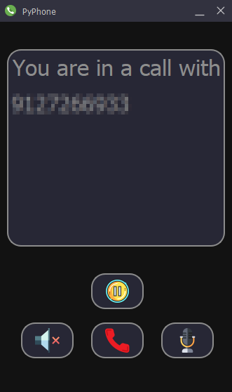

# PyPhone  
Python Based VoIP GUI Calling App  
   
## What is PyPhone?  
  
PyPhone is a fully Open Sourced Python Based GUI VoIP Calling App which enables Calling over the Internet Free of cost. PyPhone currently uses ngrok for port forwarding enabling call from anywhere around the world, with minor changes can be used as a off-grid Calling Service within LAN. It uses PyQt5 for its GUI.   
  
   
  

### Features Expected in Future releases:  
  
1. Multi-User call.  
2. Contact Directory.  
3. Advance Hold Feature.  
  
## How to use PyPhone?  
Since, PyPhone uses ngrok, it is required to make an account in [ngrok](https://ngrok.com/). PyPhone does NOT come with ngrok. Download [ngrok](https://ngrok.com/download)  
### Modules:  
1. requests  
2. pyaudio  
3. mysql-connector-python  
4. PyQt5  
5. playsound  
6. json  
  
### Steps:  
1. Make a file named "ngrok.yml" in the same level as of PyPhone.py and add the following line:  
    `authtoken: <YOUR_NGROK_AUTHTOKEN>`  
2. "config.cnf" contains the phone number of the user.  
3. Download [ngrok](https://ngrok.com/download) and paste its executable in the "modules" folder.   
Also, PyPhone uses MySQL database for storing the phone numbers and requires additional setup.(This step will not be required once PyPhone's MySQL DB is setup)  
### Steps(MySQL DB):
The MySQL requires the following setup:  
  
pyphone(Database)------> data(Table) ------------> [Phoneno varchar(12) ------------------ Port varchar(6)]
  
`CREATE DATABASE pyphone;`  
`CREATE TABLE data(Phoneno VARCHAR(12), Port VARCHAR(6));`  
`INSERT INTO data values("<PHONE_NUMBER_AFTER_REG>","<PORTNUMBER*>");`  
  
*PORTNUMBER will be automatically filled by the PyPhone.  
  
## Gallery

### ⚠️ Disclaimer: PyPhone is still in its early phase and is in no way near to a stable release. Also, there is no guarantee of its stablity and is susceptible of crashes. PyPhone still requires proper Error Handling methods and is currently not intended to used as an stable application.

### 👋 PyPhone is fully open source and you are always welcome for any contribution.

